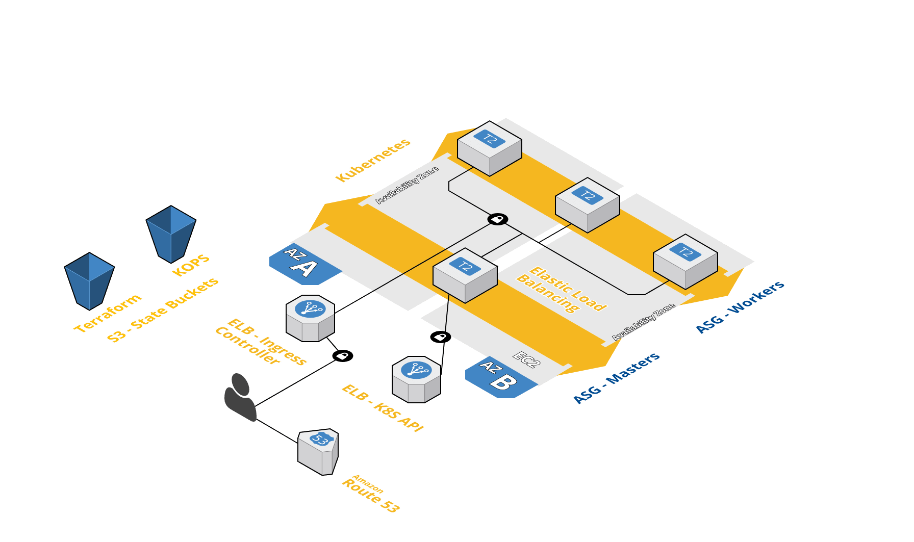
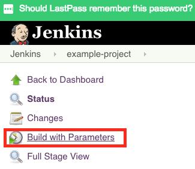
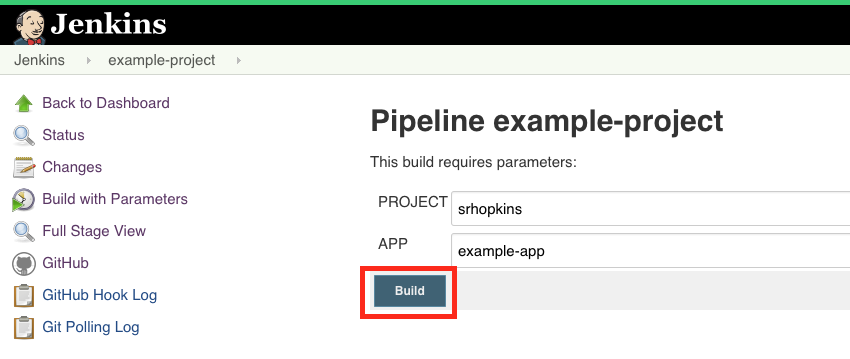
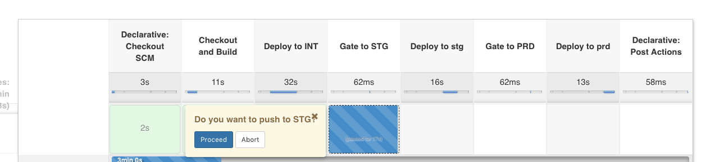

Project
---
The following Goal and MVP defined by client.

### Goal - Create application deployment process with-out downtime, using any tools comfortable to candidate.

### MVP
Using at least two running instances (VMs or containers) with sample HTML app build a deployment process automation that can publish the new app version without downtime. The app it-self can be a simple static HTML page displaying its version.

A good solution should be automated and repro-ducible, organized as a repo on Github with all required files, scripts and docs.

## URLs

| Namespace        | URL        | Description |
| ------------- |-------------| -----------|
| kube-system | https://build.steven.hopkins.rocks | Jenkins server |
| weave       | https://scope.steven.hopkins.rocks | [Weave Scope](https://www.weave.works/oss/scope/) |
| int         | https://example-app.int.steven.hopkins.rocks | Example Application - Integration Env |
| stg         | https://example-app.stg.steven.hopkins.rocks | Example Application - Stage Env |
| prd         | https://example-app.steven.hopkins.rocks | Example Application - Production Env |

## Repository Layout
### Application

Application is located in [app](app/) directory along with Dockerfile, Kubernetes configs and Jenkinsfile.

### Services

Primarily provided as [helm](https://github.com/kubernetes/helm) charts located in [charts](aws/int/us-east-1/kops-cluster/services/charts/) directory.  

### Infrastructure

Infrastructure modules live in [aws/modules/](aws/modules/) and most module instanciations located in [aws/int/us-east-1/](aws/int/us-east-1/) and dns found in [aws/global/](aws/global/). 

Primary kubernetes platform and services located under [aws/int/us-east-1/kops-cluster](aws/int/us-east-1/kops-cluster).

## How-to

### Build

There are two jobs involved in this basic build pipeline.

#### example-project
This job initiates and saves the successful build of a docker container. This job can be reused in other dockerized projects that provide a Dockerfile with necessary steps to build and run and application or service. Once a successful build is completed it calls the secondary parameterized job to deploy through each environment. 

#### example-project-deploy
This job may be run manually so that you can provide image tags to manually launch should there be an exception process such as a hotfix not processed through the build job (highly discouraged). It is primarily intended to be called by the build and deploy orchestration job `example-project`.

The `vgs-guest` user account has build permissions in the jenkins account so you can watch the pipeline in action by initiating a build.

You can use the following container scope weave view to watch new containers spin up/down along with ingress controller switch overs [weave-containers](https://scope.steven.hopkins.rocks/#!/state/{"topologyId":"containers"}).

